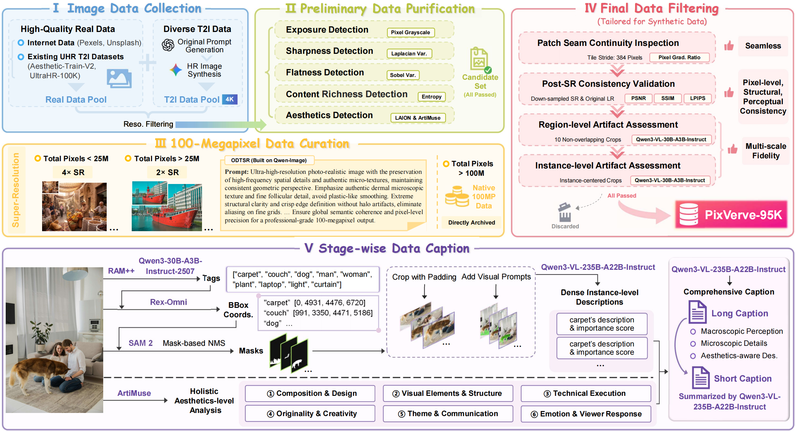
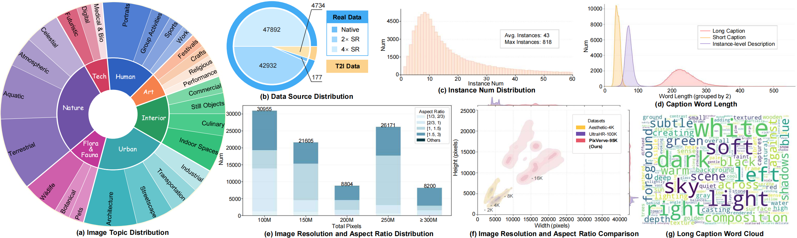

<p align="center">
    <a href=""></a> 
</p>
<p align="center">
    <a href="https://haojunchen663.github.io/"><strong>Haojun Chen</strong></a><sup>1,*</sup>
    ,
    <a href="https://scholar.google.com/citations?user=8NfQv1sAAAAJ&hl=en"><strong>Haoyang He</strong></a><sup>1,*</sup>
    ,
    <a href="https://scholar.google.com/citations?user=pjcYzvYAAAAJ&hl=zh-CN&oi=ao"><strong>Chengming Xu</strong></a><sup>2,*</sup>
    ,
    <a href="https://scholar.google.com/citations?user=gUJWww0AAAAJ"><strong>Qingdong He</strong></a><sup>1</sup>
    ,
    <a href="https://scholar.google.com/citations?user=-OxQlHsAAAAJ&hl=en"><strong>Junwei Zhu</strong></a><sup>3</sup>
    ,
    <a href="https://scholar.google.com/citations?user=xiK4nFUAAAAJ&hl=en"><strong>Yabiao Wang</strong></a><sup>1</sup>
    ,
    <a href="https://xzc-zju.github.io/"><strong>Zhucun Xue</strong></a><sup>1</sup>
    ,
    <br><a href="https://scholar.google.com/citations?hl=zh-CN&user=tgDc0fsAAAAJ"><strong>Xianfang Zeng</strong></a><sup>1</sup>
    ,
    <a href="https://scholar.google.com/citations?user=edoqkgoAAAAJ&hl=en"><strong>Zhennan Chen</strong></a><sup>3</sup>
    ,
    <a href="https://scholar.google.com.hk/citations?user=3lMuodUAAAAJ&hl=zh-CN&oi=ao"><strong>Xiaobin Hu</strong></a><sup>4</sup>
    ,
    <a href="https://sites.google.com/view/fromandto"><strong>Hao Zhao</strong></a><sup>5</sup>
    ,
    <a href="https://person.zju.edu.cn/yongliu"><strong>Yong Liu</strong></a><sup>1</sup>
    ,
    <a href="https://zhangzjn.github.io/"><strong>Jiangning Zhang</strong></a><sup>1<a href="mailto:186368@zju.edu.cn">✉</a></sup>
    ,
    <a href="https://scholar.google.com/citations?user=RwlJNLcAAAAJ&hl=en"><strong>Dacheng Tao</strong></a><sup>6</sup>
</p>
<p align="center">
    <sup>1</sup><strong>Zhejiang University</strong> &nbsp;&nbsp;&nbsp; 
    <sup>2</sup><strong>Fudan University</strong> &nbsp;&nbsp;&nbsp; 
    <sup>3</sup><strong>Nanjing University</strong> &nbsp;&nbsp;&nbsp;
    <sup>4</sup><strong>National University of Singapore</strong>
    <br><sup>5</sup><strong>Tsinghua University</strong> &nbsp;&nbsp;&nbsp;
    <sup>6</sup><strong>Nanyang Technological University</strong>
</p>
<p align="center">
    <a href='https://arxiv.org/abs/2605.20147'>
      
    </a> 
    <a href='https://haojunchen663.github.io/projects/PixVerve/'>
      
    </a>
    <a href='https://huggingface.co/datasets/HaojunChen/PixVerve-95K'>
      
    </a>
    <a href='https://modelscope.cn/datasets/APRIL6AIGC/PixVerve-95K'>
      
    </a>
</p>

## 🔥 News
- __[2026.05.20]__: We release the [paper](https://arxiv.org/abs/2605.20147), the [project page](https://haojunchen663.github.io/projects/PixVerve/), the [PixVerve-95K](https://modelscope.cn/datasets/APRIL6AIGC/PixVerve-95K) dataset, the [PixVerve-Bench](https://huggingface.co/datasets/HaojunChen/PixVerve-95K) benchmark, and the [github repo](https://github.com/HaojunChen663/PixVerve-95K).

## 📷 Introduction
💡**TL;DR:** 
[**PixVerve**](https://arxiv.org/abs/2605.20147) explores and proposes a comprehensive methodology framework spanning dataset, model, and benchmark, taking a pioneering step to advance native text-to-image generation to 100MP.

## ✨ Highlights
1. We introduce **PixVerve-95K**, the first large-scale, high-quality T2I dataset to push image resolution to 100MP. With a five-stage, automated data pipeline, we curate 95,735 100MP images with fine-grained annotations (5 types of metadata and 2 comprehensive captions), directly supporting the training or fine-tuning of T2I models at high resolutions.
2. Based on our proposed PixVerve-95K, we first **explore the attempt of generating 100MP images natively**. Specifically, we extend existing T2I foundation models (including both latent diffusion models and pixel diffusion models) with three distinct training schemes, providing valuable insights and paving the way for future breakthroughs.
3. To address the limitations of conventional T2I benchmarks, we construct **PixVerve-Bench**, a systematic, hierarchical evaluation protocol incorporating both traditional metrics and assessments based on Multimodal Large Language Models (MLLMs).

## 🎥 Overview of PixVerve-95K Dataset
<p align="center">
    <strong>Data Pipeline:</strong>
</p>


<p align="center">
    <strong>Dataset Statistical Distributions:</strong>
</p>


## 📏 Evaluation & Benchmark
1. To evaluate your model on PixVerve-Bench, you may first download the following pretrained models as referenced below:
   - [Qwen/Qwen3.5-35B-A3B](https://huggingface.co/Qwen/Qwen3.5-35B-A3B)
   - [FG-CLIP2-Base](https://huggingface.co/qihoo360/fg-clip2-base)

2. After downloading the required checkpoints, you can download the [PixVerve-Bench](https://huggingface.co/datasets/HaojunChen/PixVerve-95K) database to your local path using:
   ```
   huggingface-cli download --repo-type dataset --resume-download HaojunChen/PixVerve-95K --local-dir $YOUR_LOCAL_PATH$
   ```

3. Now you can run your own t2i model using `"long_caption"` specified in the `benchmark.jsonl` file, to generate the corresponding images. The file names of the generated images must match the corresponding `"file_name"` exactly.

4. For evaluation on the mllm-agnostic metrics:
    ```
    cd eval
    CUDA_VISIBLE_DEVICES=0 python eval.py \
       --gen_dir $YOUR_GEN_DIR$ \
       --real_dir $BENCH_IMAGES_DIR$ \
       --jsonl_file $BENCH_JSONL_PATH$ \
       --fg_clip2_model_path $FG_CLIP2_PATH$ \
    ```

5. For evaluation on the mllm-based metrics **MSFI** and **ICS**:
    - We recommend setting up Qwen3.5-35B-A3B serving using [vLLM](https://docs.vllm.ai/en/stable/getting_started/installation/index.html) (a high-throughput and memory-efficient inference and serving engine for LLMs). For detailed usage guide, see the [vLLM Qwen3.5 recipe](https://docs.vllm.ai/projects/recipes/en/latest/Qwen/Qwen3.5.html). The following will create API endpoints at `http://localhost:8000/v1`:
      ```
      vllm serve $YOUR_QWEN35_MODEL_PATH$ \
         --port 8000 --tensor-parallel-size 2 \
         --gpu-memory-utilization 0.9 \
         --max-model-len 32768 \
         --reasoning-parser qwen3 \
         --mm-encoder-tp-mode data \
         --mm-processor-cache-type shm \
         --enable-prefix-caching \
      ```
    - For Multi-scale Fidelity Index (MSFI) and Instance-centric Compliance Score (ICS) evaluation:
      ```
      cd eval
      bash run_msfi_eval.sh
      bash run_ics_eval.sh
      ```

## 🗓️ Updates
- [x] Release GitHub repo.
- [x] Release arXiv paper.
- [x] Release PixVerve-95K and PixVerve-Bench.
- [x] Release evaluation code for PixVerve-Bench.
- [ ] Release inference code.
- [ ] Release training code.
- [ ] Release model checkpoints.

## 🤗 Acknowledgement
We would like to thank the contributors to the [Diffusers](https://github.com/huggingface/diffusers), [Aesthetic-Train-V2](https://huggingface.co/datasets/zhang0jhon/Aesthetic-Train-V2), [UltraHR-100K](https://huggingface.co/datasets/zhihefang/UltraHR-100K), [ArtiMuse](https://huggingface.co/Thunderbolt215215/ArtiMuse), [ODTSR](https://github.com/RedMediaTech/ODTSR), [FLUX.2](https://github.com/black-forest-labs/flux2), [L2P](https://github.com/NJU-PCALab/L2P) [FG-CLIP2](https://huggingface.co/qihoo360/fg-clip2-base), and [Qwen](https://huggingface.co/Qwen), for their open researches.

## ⭐ Citation
If you find our work helpful, please leave us a ⭐ and cite our paper:
```
@misc{chen2026pixverveadvancingnativeuhr,
      title={PixVerve: Advancing Native UHR Image Generation to 100MP with a Large-Scale High-Quality Dataset}, 
      author={Haojun Chen and Haoyang He and Chengming Xu and Qingdong He and Junwei Zhu and Yabiao Wang and Zhucun Xue and Xianfang Zeng and Zhennan Chen and Xiaobin Hu and Hao Zhao and Yong Liu and Jiangning Zhang and Dacheng Tao},
      year={2026},
      eprint={2605.20147},
      archivePrefix={arXiv},
      primaryClass={cs.CV},
      url={https://arxiv.org/abs/2605.20147}, 
}
```